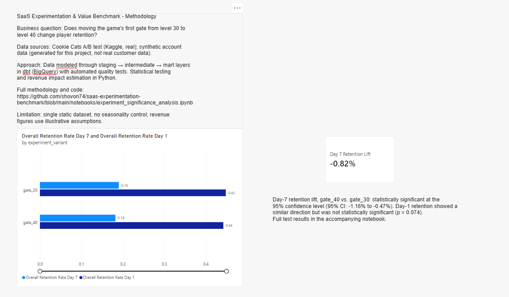

# SaaS Experimentation & Value Benchmark

A small analytics engineering project simulating how a MarTech/experimentation
platform team would model raw experiment and account data, test results for
statistical significance, and present findings to a business audience.

Built as a portfolio project to demonstrate data modeling, SQL, statistics,
and dashboarding skills — not a production system.

---

## Business Question

Does moving a product's first "gate" (a point where free users are asked to
wait or pay before continuing) later in the user journey change retention?

This mirrors the kind of question a presales/value consulting team would
investigate when helping a customer evaluate an experimentation change.

---

## Data Sources

| Source | Type | Notes |
|---|---|---|
| [Cookie Cats A/B test dataset](https://www.kaggle.com/datasets/yufengsui/mobile-games-ab-testing) (Kaggle) | Real | Mobile game A/B test: gate at level 30 (control) vs. level 40 (treatment) |
| Synthetic accounts data | Synthetic | Generated for this project (`scripts/generate_accounts.py`) to demonstrate account-dimension modeling. **Not real customer data.** |

The synthetic data is used only to demonstrate dimensional modeling
(`dim_accounts`); it is not joined into the statistical analysis, which
runs entirely on the real experiment data.

---

## Architecture

```
Raw CSVs (Kaggle + synthetic)
        │
        ▼
BigQuery (raw tables)
        │
        ▼
dbt: staging → intermediate → marts
   (with automated data quality tests)
        │
   ┌────┴────┐
   ▼         ▼
Python        Power BI
(significance  (dashboard)
testing, CI's,
value model)
```

### dbt layers

- **Staging** (`stg_cookie_cats`, `stg_accounts`) — column renaming, type
  casting, no business logic.
- **Intermediate** (`int_player_engagement`) — engagement quartiles via
  `NTILE()`, within-variant ranking via `ROW_NUMBER()`, and a running
  average via a windowed `AVG(...)`.
- **Marts** (`dim_accounts`, `fct_experiment_metrics`) — analysis-ready,
  dimensional tables. `fct_experiment_metrics` aggregates retention and
  engagement by experiment variant and engagement tier.

### Data quality

17 automated `dbt test`s covering uniqueness, not-null, accepted-value,
and range checks on the mart layer (e.g., retention rates must fall
between 0 and 1; experiment variants must be one of the two known values).

---

## Statistical Analysis

Full analysis: [`notebooks/experiment_significance_analysis.ipynb`](notebooks/experiment_significance_analysis.ipynb)

Two-proportion z-tests comparing retention between variants:

| Metric | Difference (treatment − control) | 95% CI | p-value | Significant at 95%? |
|---|---|---|---|---|
| Day-1 retention | −0.59 pp | [−1.24%, 0.06%] | 0.074 | No |
| Day-7 retention | −0.82 pp | [−1.16%, −0.47%] | < 0.05 | **Yes** |

**Key finding:** the negative effect of the later gate wasn't detectable at
Day 1 but became statistically significant by Day 7 — a result that would
be missed by a Day-1-only view, and a useful reminder to check multiple
time horizons before calling an experiment result.

An illustrative value-translation model converts the Day-7 lift into an
estimated revenue impact (100k MAU, $2.50 avg monthly revenue/user):
**−$2,050/month** (95% CI: −$3,320 to −$780). Assumptions are stated
explicitly in the notebook and are not derived from real business data.

**Caveats:** two tests were run on the same population without a multiple-
comparisons correction; the dataset has no timestamp/seasonality
information; statistical significance is not the same as practical
significance — see the notebook for the full discussion.

---

## Dashboard

Built in Power BI, connected directly to the BigQuery marts. Includes:
- Retention rate by variant (Day-1 and Day-7), with data labels
- Average game rounds by engagement tier and variant
- A headline card showing the Day-7 retention lift
- A methodology panel with the business question, data sources, and a
  link back to this notebook


*Screenshot: retention comparison, engagement by tier, and the Day-7 lift
headline card.*

---

## Repo Structure

```
saas-experimentation-benchmark/
├── dbt_project/
│   └── saas_experimentation/
│       ├── models/
│       │   ├── staging/        (stg_cookie_cats, stg_accounts, sources.yml)
│       │   ├── intermediate/   (int_player_engagement)
│       │   └── marts/          (dim_accounts, fct_experiment_metrics, schema.yml)
│       ├── dbt_project.yml
│       └── packages.yml
├── notebooks/
│   └── experiment_significance_analysis.ipynb
├── scripts/
│   └── generate_accounts.py
├── requirements.txt
├── .env.example
└── README.md
```

---

## Tech Stack

BigQuery · dbt · Python (pandas, statsmodels, scipy) · Power BI

---

## Running This Project

1. Create a BigQuery dataset and load the raw CSVs (Cookie Cats from
   Kaggle; run `scripts/generate_accounts.py` for the synthetic accounts
   file).
2. Copy `.env.example` to `.env` and fill in your own project ID, dataset,
   and service account credentials path.
3. `pip install -r requirements.txt`
4. `cd dbt_project/saas_experimentation && dbt deps && dbt run && dbt test`
5. Open `notebooks/experiment_significance_analysis.ipynb` and run all
   cells.
6. Connect Power BI to the same BigQuery dataset to reproduce the
   dashboard.

---

## Limitations & What I'd Do With More Time

- Add staging-layer tests, not just marts-layer.
- Apply a multiple-comparisons correction across the Day-1/Day-7 tests.
- Automate refreshes (e.g., GitHub Actions) rather than manual runs.
- Extend the synthetic accounts data into a real join against experiment
  activity, clearly labeled as a simulated enterprise scenario.

---

*This project uses one real public dataset and one clearly-labeled
synthetic dataset. No real customer or company data is included.*
